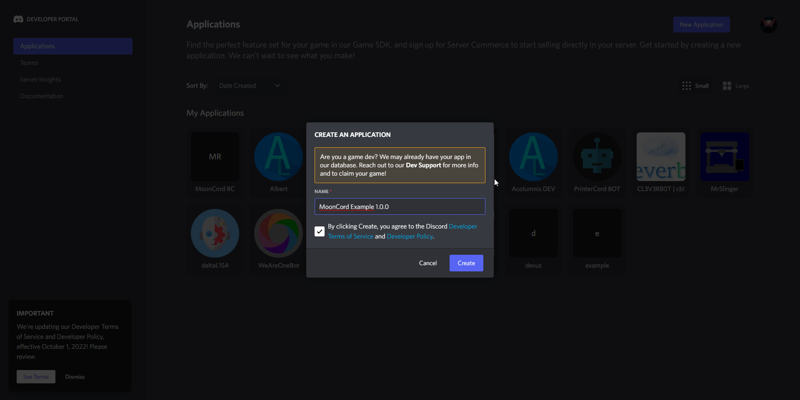
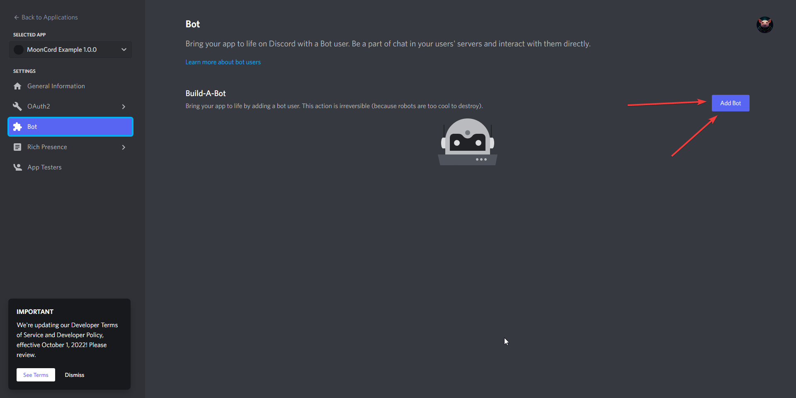
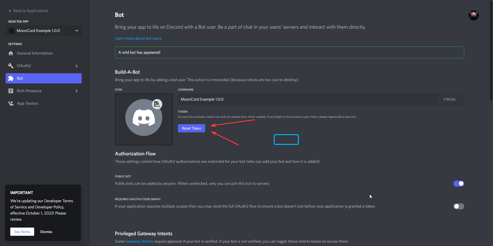
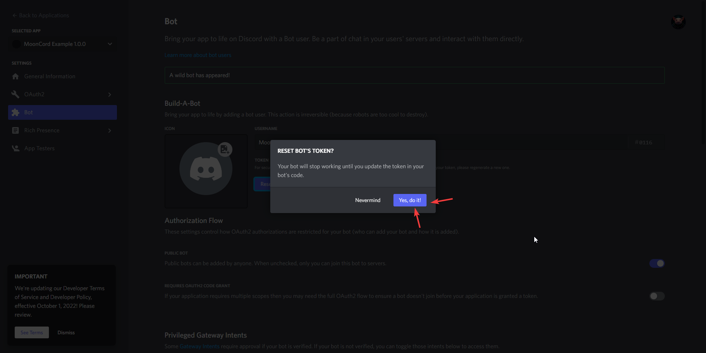
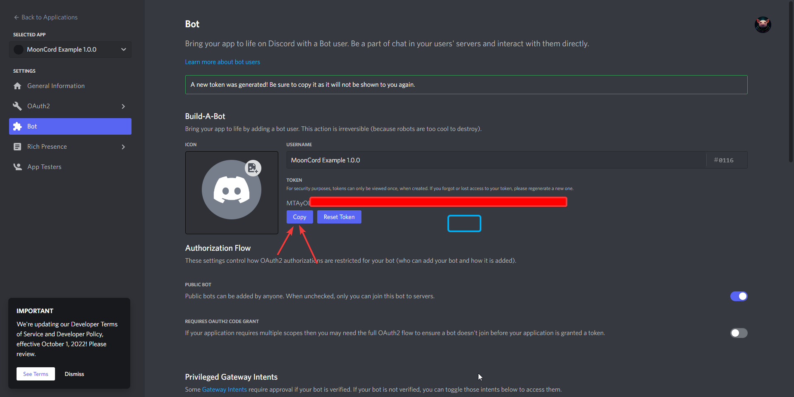
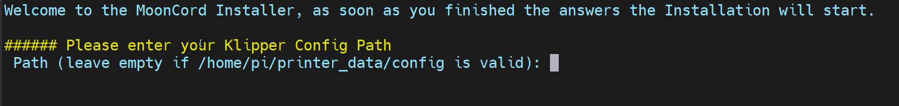
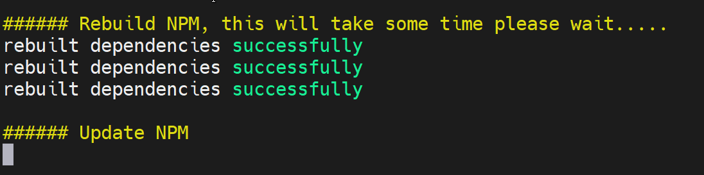

## Preparations
Required Preparations to install MoonCord

### Install Git first
```shell
sudo apt update
sudo apt upgrade
sudo apt install git
```

### Create Discord Application
go to the [Discord Application Page](https://discord.com/developers/applications) and create a new Application.


Name your application:


create a bot:



reset the bot tokeen (you will need the token later in the install script):



copy the bot token for later, you will need it later for the install script.


## Install script

Download MoonCord and start the install script
```shell
cd ~/
git clone https://github.com/eliteSchwein/mooncord.git
cd ~/mooncord
bash scripts/install.sh
```

Now follow the install script, below are screenshots with some explanation what the questions mean.


<small>enter the absolut path to your config directory of your klipper installation, when you have a normal mainsailos you can leave this empty.</small>


<small>enter the absolut path to your logs directory of your klipper installation, when you have a normal mainsailos you can leave this empty.</small>


<small>enter your Discord Bot Token from [Create Discord Application](#create-discord-application)</small>


<small>enter your full Discord tag, both the classic one with #1234 and the new one with just the name will work.</small>


<small>A present NodeJS installation was found, mooncord 1.0.3 requires nodejs 20, if you have a older or unknown nodejs Version, type Y otherwise type N.</small>


<small>the install script is rebuilding NPM to make sure that the packages can successfully install. drink some coffee ☕, eat something 🍔, this step will take some time (on a rpi4 around 7 minutes)... </small>

