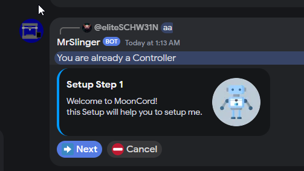
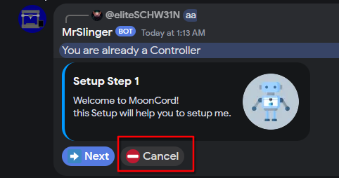

# Setup Mode

!!! info
    this is normally not required, only if you want to add a controller user (maximum permission).

```shell
sudo systemctl stop MoonCord
cd ~/mooncord
npm run start '/home/pi/printer_data/config' setup eliteschw31n
```  
<small>replace the path and username (not display name!) with your path and username.</small>  

follow the instructions till the setup wizard shows up in Discord:  
  

press the cancel button, this will stop the setup but still saves the new controller user:
  

start Mooncord again:  
`sudo systemctl start MoonCord`