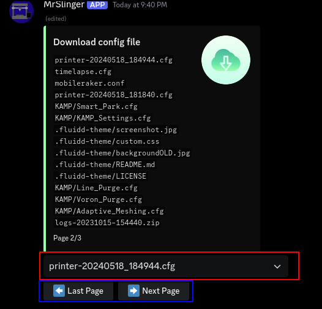

# /config get/upload [file]

`/config get`  
<small>open the config download dialog.</small>


```console
red: select here a file to download
blue: change the page
```
<br><br>
`/config upload file`  
<small>upload a config file, mooncord will auto restart klipper when its a printer.cfg</small>  
<small>you may need to restart the service with /restart SERVICE</small>