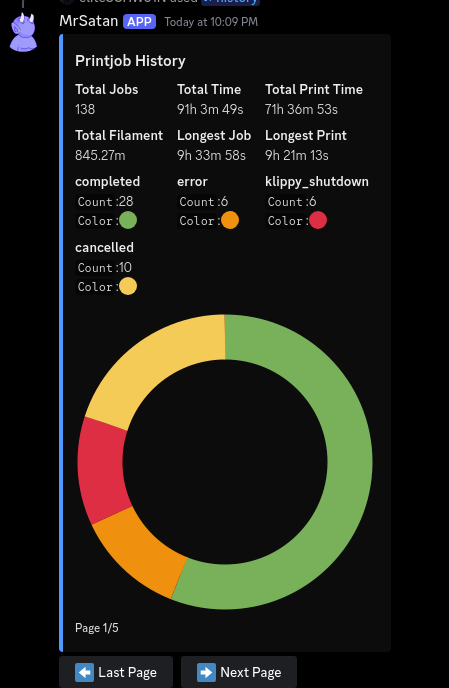
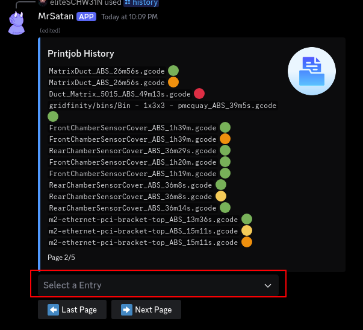
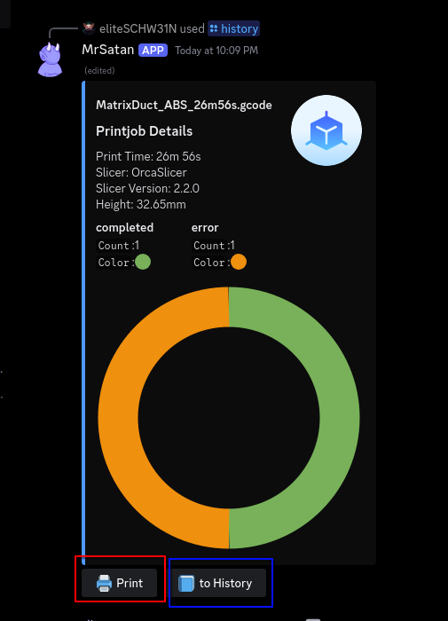

# /history

```shell
/history
```
<small>open print history.</small>  
<br><br>
  
<small>overall stats of the print history.</small>  
<br><br>
  
<small>overall stats of the print history.</small>  
<br><br>

```console
red: select here a printjob for details
```
<br><br>

```console
red: request a reprint of this printjob
blue: return to the history overview
```
<br><br>