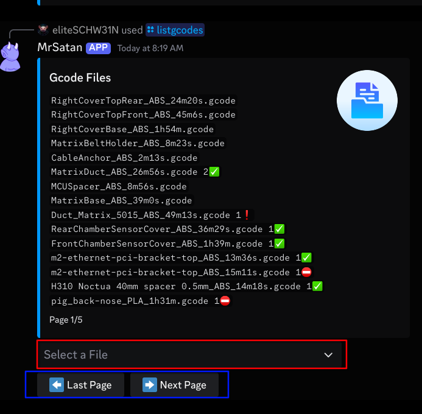
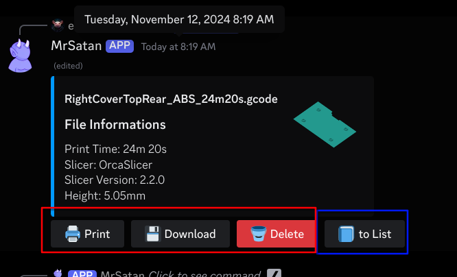

# /listgcodes

```shell
/listgcodes
```
<small>open gcode files overview.</small>  
<br><br>

```console
red: select a file for details
blue: navigate through the pages
```
<br><br>

```console
red: gcode file action buttons
blue: go back to the gcode files overview
```