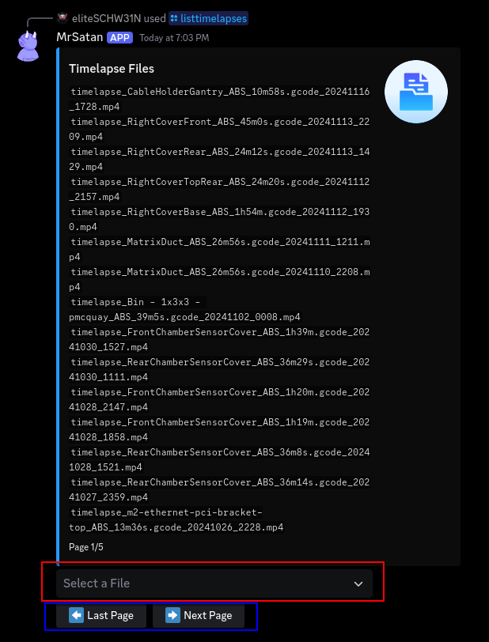
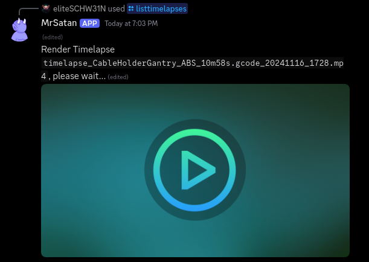

# /listtimelapses

`/listtimelapses`  
<small>open gcode files overview.</small>  
<br><br>

```console
red: select a timelapse to show it
blue: navigate through the pages
```
<br><br>
  
<small>the timelapses are getting compressed because of the discord upload limit (currently 10mb)