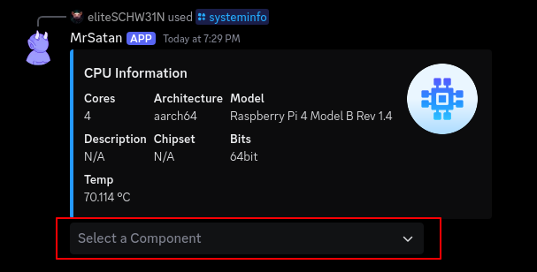

# /systeminfo

`/systeminfo`  
<small>open the systeminfo overview.</small>
<br><br>
`/systeminfo <component>`  
<small>open a specific systeminfo component.</small>
<br><br>

```console
red: select a component to show it
```
<br><br>