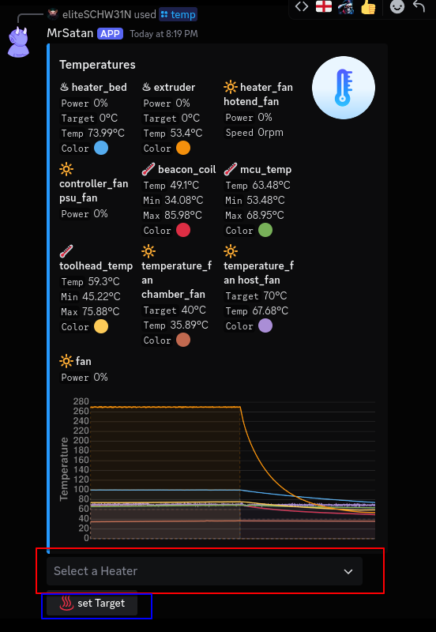
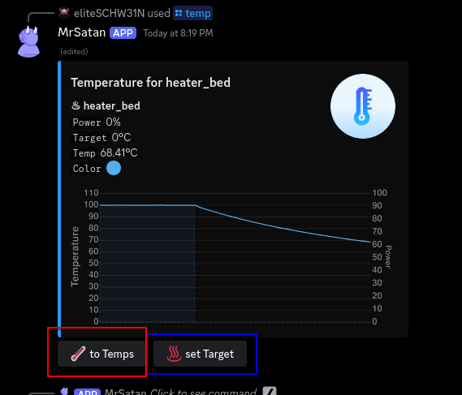

# /temp

`/temp`  
<small>shows the temperature embed.</small>
<br><br>

```console
red: show the history of a specific heater
blue: open a dialog to change the temps
```
<br><br>

```console
red: return to the temp overview
blue: open a dialog to change the temps
```