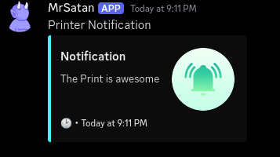
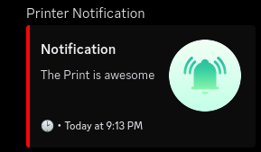

# invite gcode command

```shell
RESPOND PREFIX=mooncord.broadcast MSG="The Print is awesome"
```
<small>send a notification via gcode.</small>
<br><br>

<br><br>
```shell
RESPOND PREFIX=mooncord.broadcast MSG="The Print is awesome COLOR:ff0000"
```
<small>send a notification via gcode with custom color (hexcode without #).</small>
<br><br>
